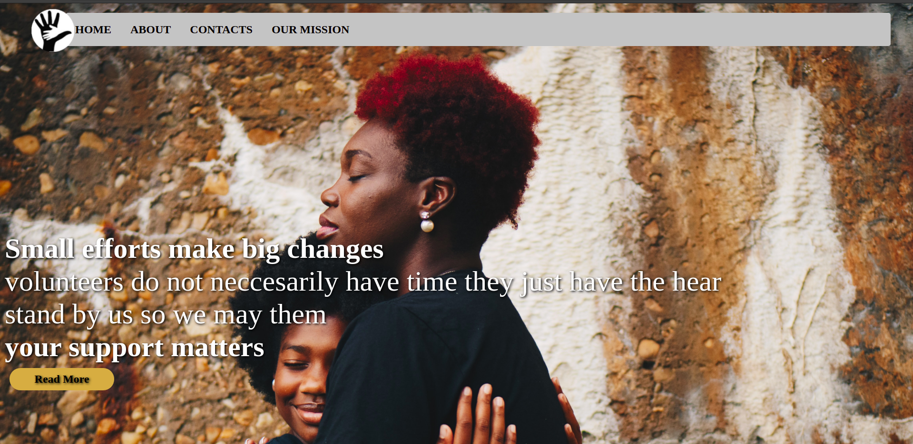

# Addressing Period Poverty

> A donation website that helps in eradicating problems facing young girls in poor backgrounds.



## Built With

- HTML
- CSS

## Live Demo

[Live Demo Link](https://barrack-coder.github.io/Addresing-Period-Poverty/)

## Getting Started

To get a local copy, follow these simple example steps.

### Prerequisites

A computer with a working and up to date web browser.

### Setup

- Clone the repository to your folder of choice using Git (or just download all the files)

```
$ git clone https://github.com/Barrack-coder/Addresing-Period-Poverty.git

```

- Open the index.html file (in the root folder) and the website should show up.

## Authors

👤 **Author**

- Barrack Odhiambo Juma
- GitHub: [@Barrack-coder](https://github.com/Barrack-coder)
- Email: barrack.juma@student.moringashool.com

👤 **Author**

- Duncan Kipkosgei Moiyo

- GitHub: [@saretoduncan](https://github.com/saretoduncan)
- twitter: [@duncan_sareto](https://twitter.com/duncan_sareto)
- Email: duncan.moiyo@student.moringaschool.com

👤 **Author**

- Easther Mutheu
- GitHub: [@easthermutheumugei](https://github.com/saretoduncan)
- Email: easther.mwengei@student.moringaschool.com

👤 **Author**

- Eudes Charles
- GitHub: [@eude313](https://github.com/eude313)
- twitter: [@_.scriptures_](https://twiter.com/_.scriptures_)
- Email: eudes.charles@student.moringaschool.com

## 🤝 Contributing

Contributions, issues, and feature requests are welcome!

Feel free to check the [issues page](ISSUE_TEMPLATE/feature_request.md).

## Show your support

Give a ⭐️ if you like this project!

## Acknowledgments

- Appreciation to Moringa school for giving us this opportunity to learn :)

## 📝 License

This project is [MIT](LICENSE) licensed.
